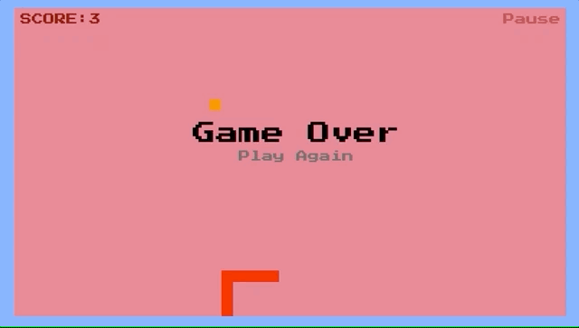

# 🐍 Snake.JS 🐍

### An elegant implementation of the game 'Snake' built with only Vanilla JavaScript, HTML and CSS.
----
### Get Started:

1. Download the source code 
2. Open 'index.html' in a browser
3. Use arrow keys or WASD to change direction
4. Press P to pause
5. Settings can be found at the top of index.html

----
### What's in the code:

1. Clean and Commented JS
2. CSS Animations
3. ES6 Class Syntax
4. No External Libraries
5. ❤️

----
### 👷 🔨 Currently working on:

1. Refactoring index.js into smaller modules
2. Adding unit tests
3. Adding a Main Menu, and the ability to modify settings

----
### Demo GIF:

